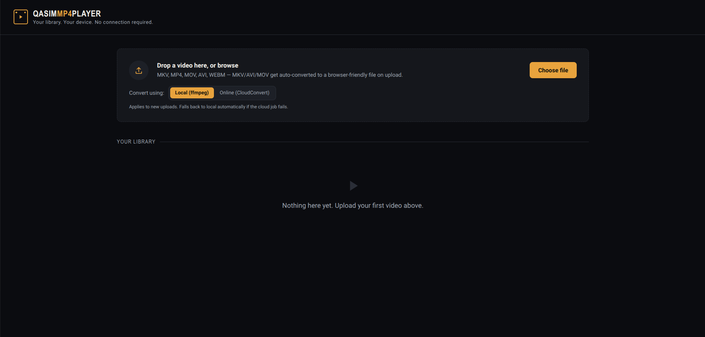

# Q Player

A lightweight, browser-based video library built with raw PHP and MySQL/MariaDB.

Q Player lets you upload your videos, automatically converts them into a browser-friendly format when necessary, and streams them directly from your local machine. Once everything is installed, the application works completely offline—no internet connection is required to watch your videos.

Unlike traditional desktop media players, Q Player runs entirely inside your browser while still providing features like automatic video conversion, resume playback, thumbnails, seeking, and a clean media library.

---

## Screenshot



---

# Features

- Upload MKV, MP4, AVI, MOV, WEBM, WMV, FLV and M4V videos
- Automatic browser-compatible video conversion
- Fast remuxing when conversion isn't required
- Background video processing
- Browser-based playback
- Resume videos from where you stopped watching
- Skip forward and backward by 10 seconds
- Draggable seek bar
- Automatic thumbnail generation
- Displays video duration and file size
- Local and CloudConvert conversion modes
- HTTP Range streaming for fast seeking
- Built using raw PHP and MySQL/MariaDB
- No PHP frameworks
- No JavaScript frameworks
- No external CDNs
- Works completely offline after installation

---

# Requirements

Before installing Q Player, make sure the following software is available on your computer.

- PHP 8.2 or newer
- MySQL or MariaDB
- FFmpeg
- FFprobe (included with FFmpeg)
- A modern browser (Chrome, Edge, Firefox or Brave)

---

# Installation

Choose the setup guide that matches your operating system.

- Windows
- macOS
- Linux / Chromebook (Debian & Crostini)

---

# Windows Installation

## Step 1 — Install XAMPP

Download and install XAMPP.

https://www.apachefriends.org/

During installation, make sure the following components are selected.

- Apache
- MySQL
- PHP

Open the XAMPP Control Panel and start:

- Apache
- MySQL

You should now be able to visit:

```
http://localhost
```

If the XAMPP dashboard appears, you're ready for the next step.

---

## Step 2 — Install FFmpeg

Download FFmpeg from:

https://ffmpeg.org/download.html

Extract it somewhere permanent, for example:

```
C:\ffmpeg
```

Add:

```
C:\ffmpeg\bin
```

to your Windows Environment Variables (PATH).

Open Command Prompt and verify the installation.

```bash
ffmpeg -version
```

If you see version information, FFmpeg has been installed correctly.

---

## Step 3 — Download the Project

Clone the repository or download it as a ZIP file.

Move the project into:

```
xampp\htdocs\
```

Example:

```
xampp\htdocs\Q-Player
```

---

## Step 4 — Import the Database

Open phpMyAdmin.

Create a new database named:

```
q_mp4_player
```

Click **Import**.

Select:

```
schema.sql
```

Click **Go**.

The database tables will be created automatically.

---

## Step 5 — Configure the Database

Open:

```
config.php
```

Update the database credentials.

```php
define('DB_HOST', 'localhost');
define('DB_USER', 'root');
define('DB_PASS', '');
define('DB_NAME', 'q_mp4_player');
```

If you're using a different username or password, update those values accordingly.

---

## Step 6 — Increase PHP Upload Limits

Open your XAMPP `php.ini`.

Update these values.

```ini
upload_max_filesize = 4096M
post_max_size = 4096M
max_execution_time = 0
memory_limit = 512M
```

Save the file and restart Apache from the XAMPP Control Panel.

---

## Step 7 — Start Using Q Player

Open your browser.

```
http://localhost/Q-Player
```

If the homepage loads successfully, the installation is complete.

---

# macOS Installation

## Step 1 — Install Homebrew

If Homebrew isn't already installed, install it from:

https://brew.sh/

Verify it works.

```bash
brew --version
```

---

## Step 2 — Install the Required Packages

```bash
brew install php
brew install mariadb
brew install ffmpeg
```

Verify the installation.

```bash
php -v
ffmpeg -version
```

---

## Step 3 — Start MariaDB

```bash
brew services start mariadb
```

Check its status.

```bash
brew services list
```

MariaDB should show as **started**.

---
## Step 4 — Import the Database

Import the database using the terminal.

```bash
mysql -u root < schema.sql
```

If your MariaDB installation requires a password:

```bash
mysql -u root -p < schema.sql
```

---

## Step 5 — Configure the Database

Open:

```
config.php
```

Update the database credentials if necessary.

```php
define('DB_HOST', 'localhost');
define('DB_USER', 'root');
define('DB_PASS', '');
define('DB_NAME', 'q_mp4_player');
```

---

## Step 6 — Increase PHP Upload Limits

Locate your PHP configuration.

```bash
php --ini
```

Open the **Loaded Configuration File** shown by the command.

Update these values.

```ini
upload_max_filesize = 4096M
post_max_size = 4096M
max_execution_time = 0
memory_limit = 512M
```

Save the file.

---

## Step 7 — Start the Development Server

Navigate into the project folder.

```bash
cd Q-Player
```

Start PHP's built-in web server.

```bash
php -S localhost:8000
```

Open your browser and visit:

```
http://localhost:8000
```

If the homepage appears, the installation is complete.

---

# Linux / Chromebook Installation

These instructions have been tested on Debian 12 and ChromeOS Linux (Crostini).

## Step 1 — Enable Linux (Chromebook Only)

On ChromeOS:

Settings → Advanced → Developers → Turn on Linux

Once the installation finishes, open the Terminal application.

If you're already using Linux, skip this step.

---

## Step 2 — Update Packages

```bash
sudo apt update
```

---

## Step 3 — Install PHP, MariaDB and FFmpeg

```bash
sudo apt install -y php php-mysql mariadb-server ffmpeg
```

Verify the installation.

```bash
php -v
ffmpeg -version
```

---

## Step 4 — Start MariaDB

```bash
sudo service mariadb start
```

Verify that it's running.

```bash
sudo service mariadb status
```

You should see:

```
Active: active (running)
```

Press **Q** to leave the status screen.

---

## Step 5 — Import the Database

Run:

```bash
sudo mariadb < schema.sql
```

Or if you're using password authentication:

```bash
mariadb -u root -p < schema.sql
```

This creates the database and all required tables automatically.

---

## Step 6 — Configure the Database

Open:

```
config.php
```

Update the database credentials.

Example:

```php
define('DB_HOST', 'localhost');
define('DB_USER', 'root');
define('DB_PASS', '');
define('DB_NAME', 'q_mp4_player');
```

If you're using another database account, replace the username and password with your own.

---

## Step 7 — Increase Upload Limits

Find the active PHP configuration.

```bash
php --ini
```

Edit the **Loaded Configuration File**.

Update these values.

```ini
upload_max_filesize = 4096M
post_max_size = 4096M
max_execution_time = 0
memory_limit = 512M
```

Save the file.

---

## Step 8 — Start the Server

Navigate into the project directory.

```bash
cd Q-Player
```

Start PHP.

```bash
php -S localhost:8000
```

Open Chrome and visit:

```
http://localhost:8000
```

The application is now ready to use.

---

# Using Q Player

Using the application is simple.

1. Upload one or more videos.
2. Wait for the conversion to finish if necessary.
3. Click any video in the library.
4. Watch it directly from your browser.

Q Player automatically saves your playback position every few seconds. The next time you open the same video, you'll be asked if you'd like to continue where you left off.

---

# How Video Conversion Works

Modern browsers cannot play every video codec.

Instead of always converting every upload, Q Player uses a three-step conversion process to save time.

### 1. Stream Copy

If the uploaded video already contains browser-compatible codecs, FFmpeg simply repackages it into an MP4 container.

This usually finishes within a few seconds because nothing is re-encoded.

---

### 2. Audio Conversion

If only the audio codec isn't supported, Q Player copies the video stream and converts only the audio to AAC.

This is much faster than converting the entire video.

---

### 3. Full Video Conversion

If the browser cannot decode the video codec, Q Player performs a complete conversion to H.264 video with AAC audio.

Although this takes longer, it guarantees browser compatibility.

---

# CloudConvert Mode

For slower computers, Q Player also supports CloudConvert.

When enabled, uploaded videos are sent to CloudConvert for processing instead of being converted locally.

After conversion finishes, the browser-compatible file is downloaded automatically.

If CloudConvert isn't configured or the conversion fails, Q Player automatically falls back to local FFmpeg conversion.

---

# Project Structure

```
Q-Player/

├── assets/
│   ├── css/
│   └── js/
│
├── screenshots/
│
├── uploads/
│   ├── originals/
│   ├── thumbnails/
│   └── videos/
│
├── config.php
├── schema.sql
├── index.php
├── upload.php
├── convert.php
├── stream.php
├── watch.php
├── delete.php
├── save_progress.php
├── convert_status.php
└── README.md
```

---

# Troubleshooting

## Access denied for user

Your database username or password is incorrect.

Update the credentials in:

```
config.php
```

---

## Upload failed (code no file)

Your PHP upload limits are too low.

Increase:

```
upload_max_filesize
post_max_size
```

Restart Apache or restart the PHP development server afterwards.

---

## FFmpeg not found

Verify that FFmpeg is installed.

```bash
ffmpeg -version
```

If the command isn't recognised, install FFmpeg or update the path in `config.php`.

---

## Conversion is taking too long

Video conversion depends on your processor.

Older laptops and Chromebooks may take several minutes to convert large HEVC videos.

For faster conversions, enable CloudConvert mode.

---

## Video won't play

Delete the converted file and upload it again.

If the conversion fails, the application stores the FFmpeg error message so you can identify the problem.

---

# Roadmap

Future improvements planned for Q Player include:

- Subtitle support (.srt and .ass)
- Multiple video libraries
- Playlist support
- Video categories
- Search and filtering
- Keyboard shortcuts
- Picture-in-Picture mode
- Dark and light themes
- Mobile layout improvements
- Hardware-accelerated transcoding
- User accounts and permissions

---

# Contributing

Contributions are welcome.

If you'd like to improve Q Player, fix bugs or suggest new features, feel free to open an issue or submit a pull request.

---

# License

This project is released under the MIT License.

You're free to use, modify and distribute it in accordance with the terms of the license.